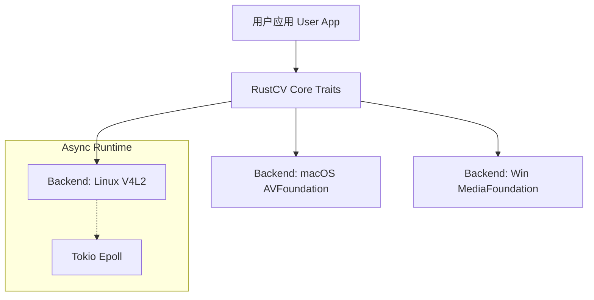

<div align="center">

  

  # RustCV

  **高性能异步摄像头驱动库 | High-Performance Async Camera Library**

  <p>
    专为机器人、嵌入式设备和 AI 视觉应用打造。<br>
    基于 Rust <b>Async/Await</b> (Tokio) 实现真正的零拷贝与高并发视频流采集。
  </p>

  <a href="https://github.com/rustcv/rustcv/actions">
    
  </a>
  <a href="https://crates.io/crates/rustcv">
    
  </a>
  <a href="https://github.com/rustcv/rustcv/blob/main/LICENSE">
    
  </a>
  <br>
  <br>
</div>

---

## ✨ 核心特性 (Features)

- 🦀 **Pure Rust**: 安全、内存友好，无 GC 负担。
- ⚡ **Async First**: 基于 `Tokio`，完美契合现代异步 Rust 生态。
- 🚀 **High Performance**: 针对 V4L2 实现了 `mmap` 零拷贝采集。
- 🤖 **Robotics Ready**: 原生支持双目并发（Stereo Vision）与多流同步。
- 🌐 **Web Streaming**: 内置 MJPEG 流媒体服务器，便于远程调试。

---

## 🖥️ 平台支持 (Platform Support)

RustCV 旨在提供统一的 Trait 抽象层，屏蔽底层操作系统差异。

| 平台 (Platform) | 后端 (Backend) | 状态 (Status) | 说明 (Note) |
| :--- | :--- | :---: | :--- |
| **Linux** (Ubuntu/Debian) | `v4l2` | ✅ **Stable** | 完整支持 (采集/控制/并发/推流) |
| **macOS** | `avfoundation` | 🚧 **WIP** | 正在开发中 (Objc2 binding) |
| **Windows** | `media_foundation`| 📅 **Planned** | 计划中 |

---

## 🐧 Linux (Ubuntu) 使用指南

目前 Linux 后端基于 **V4L2** 深度优化，适用于 **树莓派**、**香橙派**、**Jetson** 及标准 PC。

### 1. 环境准备 (Prerequisites)

安装构建工具和 V4L 调试工具：

```bash
sudo apt update
sudo apt install build-essential llvm-dev libclang-dev clang libv4l-dev v4l-utils pkg-config libxkbcommon-dev libwayland-dev libx11-dev

# 权限设置：将当前用户加入 video 组 (需注销或重启生效)
sudo usermod -aG video $USER
```

### 2. 快速接入 (Quick Start)

在 `Cargo.toml` 中添加依赖：

```toml
[dependencies]
rustcv-core = "0.1"
rustcv-backend-v4l2 = "0.1"
tokio = { version = "1.0", features = ["full"] }
anyhow = "1.0"
```

**最小代码示例 (`main.rs`)：**

```rust
use rustcv_core::traits::{Driver, Stream};
use rustcv_backend_v4l2::V4l2Driver;
use rustcv_core::builder::{CameraConfig, Priority};

#[tokio::main]
async fn main() -> anyhow::Result<()> {
    // 1. 初始化驱动并列出设备
    let driver = V4l2Driver::new();
    let devices = driver.list_devices()?;
    
    if devices.is_empty() {
        println!("未检测到摄像头设备");
        return Ok(());
    }

    // 2. 配置参数 (640x480 @ 30FPS)
    let config = CameraConfig::new()
        .resolution(640, 480, Priority::Required)
        .fps(30, Priority::High);

    // 3. 打开第一个设备
    let (mut stream, _controls) = driver.open(&devices[0].id, config)?;

    // 4. 启动采集循环
    stream.start().await?;
    println!("摄像头启动成功: {}", devices[0].name);
    
    // 5. 获取一帧数据
    if let Ok(frame) = stream.next_frame().await {
        println!("采集帧: {}x{} | 大小: {} bytes", frame.width, frame.height, frame.data.len());
    }
    
    Ok(())
}
```

---

## 📦 示例大全 (Examples)

本项目包含多个开箱即用的示例，覆盖了从基础显示到网络推流的场景。

| 示例名称 | 命令 | 描述 |
| --- | --- | --- |
| **📸 基础预览** | `cargo run -p rustcv-backend-v4l2 --example camera_view` | 查看单摄画面、帧率和时间戳 |
| **👯 双目并发** | `cargo run -p rustcv-backend-v4l2 --example dual_camera_view` | **机器人核心功能**。同时采集并显示双路摄像头数据 |
| **🌐 Web 预览** | `cargo run -p rustcv-backend-v4l2 --example web_streaming` | 启动 Web 服务器，通过浏览器低延迟查看画面 |
| **🚀 双路推流** | `cargo run -p rustcv-backend-v4l2 --example dual_web_streaming` | 同时将两个摄像头画面推流至 Web (左右分屏) |

> **提示**：运行 Web 示例后，请访问 `http://localhost:3000`

---

## 🛠️ 架构设计 (Architecture)



* **rustcv-core**: 定义标准接口 (`Driver`, `Stream`) 和数据结构。
* **rustcv-backend-v4l2**: Linux 实现。使用 `epoll` 实现异步 IO，配合 `mmap` 实现零拷贝。
* **rustcv-backend-avf**: macOS 实现 (WIP)。

---

## 🗺️ 路线图 (Roadmap)

* [x] **Core**: 基础 Trait 定义与配置构建器
* [x] **Linux**: V4L2 异步驱动实现 (Epoll/Mmap)
* [x] **Linux**: 多摄并发支持 (Dual Camera)
* [x] **Linux**: MJPEG Web 推流服务器
* [ ] **macOS**: AVFoundation 后端实现 (Dev in progress...)
* [ ] **Windows**: Media Foundation 后端实现
* [ ] **Tools**: 统一的跨平台 CLI 调试工具

---

## ❓ 常见问题 (FAQ)

<details>
<summary><b>Permission denied (os error 13) 怎么办？</b></summary>

这是因为当前用户没有访问 `/dev/video*` 的权限。请执行以下命令将用户加入 video 组，并**重启系统**或注销重登：

```bash
sudo usermod -aG video $USER
```

</details>

<details>
<summary><b>Web 流画面卡顿？</b></summary>

JPEG 编码是 CPU 密集型操作。在 Debug 模式下 Rust 运行较慢，请尝试使用 Release 模式运行：

```bash
cargo run --release -p rustcv-backend-v4l2 --example web_streaming
```

</details>

---

<div align="center">
<sub>Built with ❤️ by the RustCV Team</sub>
</div>
