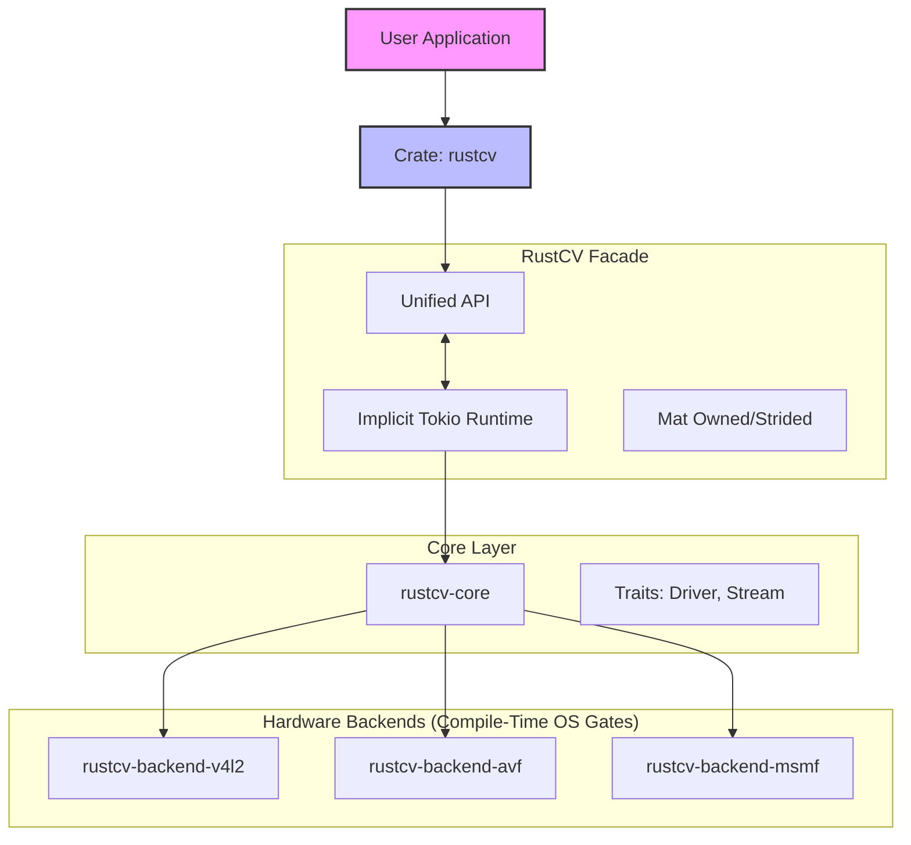

<div align="center">
 

# 📷 RustCV

English | [简体中文](README_zh.md)

### RustCV: A Modern, OpenCV-Compatible Vision Framework for the Rust Era

[](https://github.com/rustcv/rustcv)
[](#)
[](#)
[](#)
[](LICENSE)
[](https://www.rust-lang.org/)

🔗 [Join the Discord](https://discord.gg/HkskXFgWAE)

**RustCV is the spiritual successor to OpenCV in the Rust ecosystem.**
It provides a unified Facade layer, allowing you to enjoy Rust's memory safety and zero-copy performance using the familiar classical API style.

</div>

---

## 📖 Introduction

**RustCV** is a high-performance, native Rust computer vision library aimed at solving ecosystem fragmentation. It is *not* a simple FFI binding, but a ground-up pure Rust implementation.

- **OpenCV Parity**: Provides familiar APIs such as `VideoCapture`, `Mat`, and `imshow`, significantly reducing migration costs for developers coming from C++.
- **Hidden Complexity**: The backend is powered by a **Tokio-based asynchronous driver**, while exposing a clean, **synchronous blocking interface**. You get the performance of async I/O without the boilerplate of `async/await`.
- **Out-of-the-box**: Intelligently identifies the `target_os` statically and links the absolute best native camera drivers dynamically. Zero-configuration cross-platform support.

## ✨ Key Features

- **🦀 Rust Native**: Written entirely in Rust. Say goodbye to C++ shared library "dependency hell" and complex CMake configurations.
- **⚡ Extreme Performance**:
  - Integrated **Lazy Global Runtime** for automatic management of asynchronous hardware interactions.
  - Supports **Stride** memory layout, allowing direct mapping of hardware buffers. Built-in zero-bounds-checking copies and SIMD-ready iterators guarantee max FPS even in debug builds.
- **🎨 Full Native Driver Architecture**:
  - **Linux**: Native `V4L2` driver integration.
  - **macOS**: Native `AVFoundation` driver integration (Features efficient `32BGRA` rendering and strictly bounded GCD queues).
  - **Windows**: Native `MediaFoundation` (MSMF) driver integration.
- **🛠️ Dynamic Hot-Reloading & Strong Types**: No more "magic numbers." Use ergonomic APIs like `cap.set_resolution(1280, 720)` to hot-swap hardware resolution on the fly without dropping camera handles.

## 🖥️ Platform Support

The project has successfully completed the core backend driver adaptation for all three major desktop operating systems:

| Platform    | Backend Technology | Status                      | Core Capabilities                                                                                                                           |
| :---------- | :----------------- | :-------------------------- | :----------------------------------------------------------------------------------------------------------------------------------------- |
| **Linux**   | **V4L2**           | 🟢 Stable Support            | YUYV/MJPEG decoding, hardware device enumeration, dynamic resolution configuration. |
| **macOS**   | **AVFoundation**   | 🟢 Stable Support            | Concurrent GCD queue rendering, BGRA hardware passthrough, zero-copy data streaming, and dynamic Preset configuration. |
| **Windows** | **MSMF**           | 🟢 Stable Support            | Native Media Foundation integration and hardware access wrapper. |

## 📦 Installation

Add RustCV to your `Cargo.toml`:

```toml
[dependencies]
rustcv = "0.1"

# Optional: Enable high-speed hardware-level JPEG decoding
# rustcv = { version= "0.1", features = ["turbojpeg"] }
```

> **Note:** The library automatically pulls in the correct underlying dependencies (`rustcv-backend-v4l2`, `rustcv-backend-avf`, etc.) based on the current `target_os` during compilation. No manual feature configuration is requisite!

## 🚀 Quick Start

This is the most exciting part. See how clean the code is. Below is a complete, practical example featuring **dynamic resolution hot-reloading** and **FPS monitoring**:

```rust
use anyhow::Result;
use rustcv::{
    highgui,    // Windowing and Event Loop
    imgproc,    // Image Processing and Drawing Primitives
    prelude::*, // Auto-import VideoCapture, Mat, etc.
};
use std::time::Instant;

fn main() -> Result<()> {
    // 1. Open the default camera (index 0)
    // The hidden Async Runtime starts automatically in the background
    println!("Opening camera...");
    let mut cap = VideoCapture::new(0)?;

    // 2. Configure initial hardware resolution (Synchronous blocking call)
    cap.set_resolution(640, 480)?;
    
    // Pre-allocate the memory matrix for image frames
    let mut frame = Mat::empty();
    let mut high_res_mode = false;

    // FPS Tracker
    let mut last_time = Instant::now();
    let mut frame_count = 0;
    let mut fps = 0.0;

    println!("Start capturing... Press SPACE to toggle resolution. Press ESC to exit.");

    // 3. Classic OpenCV-style main read loop
    while cap.read(&mut frame)? {
        if frame.is_empty() { continue; }

        // --- Image Processing (Zero-Copy / In-place modification) ---
        // Draw a static tracking rectangle
        imgproc::rectangle(
            &mut frame,
            imgproc::Rect::new(200, 150, 240, 240),
            imgproc::Scalar::new(0, 255, 0), // Green (BGR)
            2,
        );

        // Update calculated FPS every 10 frames
        frame_count += 1;
        if frame_count % 10 == 0 {
            fps = 10.0 / last_time.elapsed().as_secs_f64();
            last_time = Instant::now();
            frame_count = 0;
        }

        // Render HUD Text (Red)
        let hud_text = format!("FPS: {:.1}  Res: {}x{}", fps, frame.cols, frame.rows);
        imgproc::put_text(
            &mut frame,
            &hud_text,
            imgproc::Point::new(10, 30),
            1.0, 
            imgproc::Scalar::new(0, 0, 255), 
        );

        // --- Cross-Platform Window Display ---
        highgui::imshow("RustCV Camera Pipeline", &frame)?;

        // --- Keyboard Events & Dynamic Control ---
        let key = highgui::wait_key(1)?;
        if key == 27 { // ESC to exit
            break;
        }

        // Spacebar: Dynamically change hardware capture resolution (Hot reloading)
        if key == 32 {
            high_res_mode = !high_res_mode;
            let (w, h) = if high_res_mode { (1280, 720) } else { (640, 480) };
            println!("🔄 Hot Reloading hardware resolution to {}x{}...", w, h);
            
            if let Err(e) = cap.set_resolution(w, h) {
                eprintln!("❌ Failed to reload: {}", e);
            }
        }
    }

    // 4. Cleanup resources (The underlying pipeline Drops automatically, explicit call is cleaner)
    highgui::destroy_all_windows()?;
    Ok(())
}
```

Run the example:

```bash
cargo run --example camera_demo -p rustcv
```


## 🏗️ Architecture

RustCV is designed around the **Facade Pattern**. The backend is highly modular while the frontend remains completely unified. It enforces the inclusion of the correct implementation backend at compile time using OS macros, ensuring absolute reliability across multiple platforms.


```mermaid
graph TD
    User[User Application] --> RustCV[Crate: rustcv]

    subgraph "RustCV Facade"
        API[Unified API]
        RT[Implicit Tokio Runtime]
        Mat[Mat Owned/Strided]
    end

    RustCV --> API
    API <--> RT

    subgraph "Core Layer"
        Core[rustcv-core]
        Traits[Traits: Driver, Stream]
    end

    RT --> Core

    subgraph "Hardware Backends (Compile-Time OS Gates)"
        V4L2[rustcv-backend-v4l2]
        AVF[rustcv-backend-avf]
        MSMF[rustcv-backend-msmf]
    end

    Core --> V4L2
    Core --> AVF
    Core --> MSMF

    style User fill:#f9f,stroke:#333,stroke-width:2px
    style RustCV fill:#bbf,stroke:#333,stroke-width:2px
```

## 🤝 Contributing

We welcome all forms of contribution! Whether it's reporting an Issue, completing code tests, or porting entirely new vision algorithms, you are very welcome!

1. Fork the repository.
2. Create your feature branch (`git checkout -b feature/AmazingFeature`).
3. Commit your changes (`git commit -m 'Add some AmazingFeature'`).
4. Push to the branch (`git push origin feature/AmazingFeature`).
5. Open a Pull Request.

## 📄 License

Distributed under the MIT License. See `LICENSE` for more information.

---

<div align="center">
    Build with ❤️ in Rust
</div>
