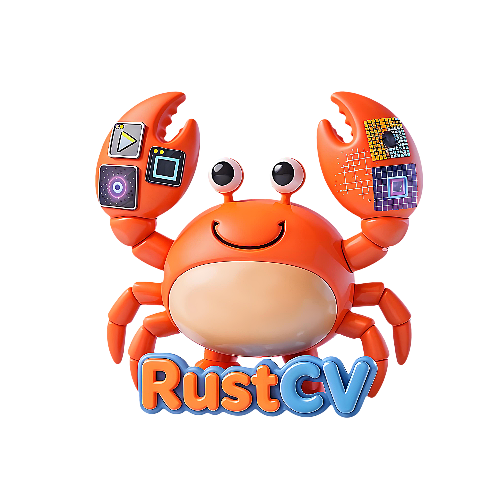
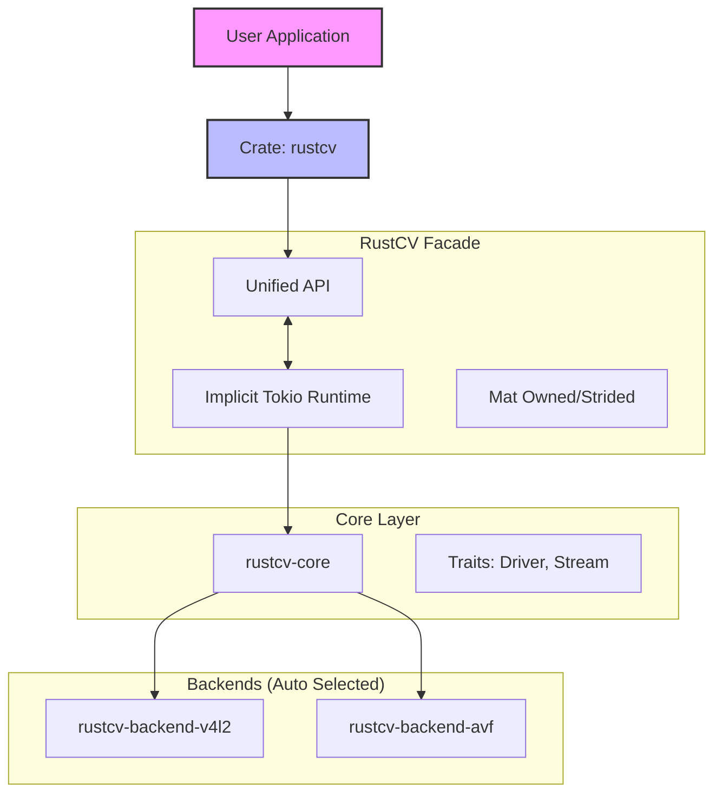

<div align="center">
 

# 📷 RustCV

[English](README.md) | 简体中文

### RustCV：用现代 Rust 重新定义的 OpenCV 兼容视觉处理框架

[](https://github.com/your-repo/rustcv)
[](https://github.com/your-repo/rustcv)
[](LICENSE)
[](https://www.rust-lang.org/)

**RustCV 是 OpenCV 在 Rust 时代的精神续作。**
它提供了一个统一的门面层（Facade），让你用最熟悉的 API 风格，享受 Rust 带来的内存安全与零拷贝高性能。

[✨ 特性](#-核心特性-key-features) • [📦 安装](#-安装-installation) • [🚀 快速开始](#-快速开始-quick-start) • [🏗️ 架构](#%EF%B8%8F-架构-architecture) • [🔧 平台支持](#-平台支持-platform-support) • [🤝 贡献](#-贡献-contributing)

</div>

---

## 📖 简介 (Introduction)

**RustCV** 旨在解决 Rust 生态中机器视觉库碎片化的问题。它不是简单的 FFI 绑定，而是从零构建的纯 Rust 实现。

- **对标 OpenCV**：提供 `VideoCapture`, `Mat`, `imshow` 等经典 API，极大降低迁移成本。
- **隐藏复杂性**：底层基于 `Tokio` 异步驱动，但对外暴露**同步阻塞**接口。你不需要处理 `async/await`，就能享受异步 IO 的性能。
- **零拷贝设计**：通过智能的 **Buffer Swapping** 技术，实现从内核驱动到用户态 `Mat` 的零拷贝数据流转。

## ✨ 核心特性 (Key Features)

- 🦀 **Rust Native**: 纯 Rust 编写，无 C++ 依赖地狱。
- ⚡ **高性能**:
  - 内部集成 `Lazy Global Runtime`，自动管理异步驱动。
  - 支持 `Stride` 内存布局，直接映射硬件缓冲区。
- 🎨 **开箱即用**:
  - **VideoIO**: 支持 V4L2 (Linux) 和 AVFoundation (macOS, WIP)。
  - **HighGUI**: 基于 `minifb` 的轻量级跨平台窗口显示。
  - **ImgProc**: 内置绘图原语（画框、写字）和 FPS 计算。
  - **ImgCodecs**: 集成 `image-rs`，支持主流格式读写。
- 🛠️ **强类型配置**: 拒绝魔法数字，提供 `cap.set_resolution(1280, 720)` 等强类型 API。

## 📦 安装 (Installation)

在你的 `Cargo.toml` 中添加依赖：

```toml
[dependencies]
rustcv = "0.1"

# 或者手动指定
# rustcv = { version= "0.1", features = ["linux-v4l2"] }
```

## 🚀 快速开始 (Quick Start)

这是最激动人心的部分。看看代码是多么简洁：

```rust
use anyhow::Result;
use rustcv::prelude::*; // 引入 VideoCapture, Mat
use rustcv::highgui;    // 引入 GUI
use rustcv::imgproc;    // 引入 绘图

fn main() -> Result<()> {
    // 1. 打开摄像头 (索引 0)
    // 底层自动启动异步 Runtime，无需 #[tokio::main]
    let mut cap = VideoCapture::new(0)?;

    // 2. (可选) 设置高清分辨率
    cap.set_resolution(640, 480)?;

    let mut frame = Mat::empty();

    println!("🎥 Start capturing... Press ESC to exit.");

    // 3. 经典循环
    while cap.read(&mut frame)? {
        if frame.is_empty() { continue; }

        // --- 图像处理 ---
        // 在左上角绘制分辨率
        imgproc::put_text(
            &mut frame,
            &format!("Res: {}x{}", frame.cols, frame.rows),
            imgproc::Point::new(10, 30),
            1.0,
            imgproc::Scalar::new(0, 0, 255) // Red
        );

        // 画一个绿色的框
        imgproc::rectangle(
            &mut frame,
            imgproc::Rect::new(200, 200, 300, 300),
            imgproc::Scalar::new(0, 255, 0), // Green
            2
        );

        // --- 显示 ---
        highgui::imshow("RustCV Demo", &frame)?;

        // --- 按键 ---
        if highgui::wait_key(1)? == 27 { // ESC
            break;
        }
    }

    Ok(())
}
```

运行示例：

```bash
cargo run -p rustcv --example demo
```


## 🏗️ 架构 (Architecture)

RustCV 采用**门面模式 (Facade Pattern)** 设计，底层模块化，上层统一化。



## 🔧 平台支持 (Platform Support)

目前项目处于快速迭代期，平台支持情况如下：

| 平台        | 后端技术        | 状态          | 备注                                 |
| :---------- | :-------------- | :------------ | :----------------------------------- |
| **Linux**   | **V4L2**        | ✅ **Stable** | 支持 MJPEG/YUYV 解码，支持热重载     |
| **macOS**   | AVFoundation    | 🚧 _Beta_     | 基础代码已就绪，正在完善 Buffer 映射 |
| **Windows** | MediaFoundation | 📅 _Planned_  | 计划中                               |

## 🤝 贡献 (Contributing)

我们欢迎任何形式的贡献！无论是提交 Issue，还是为特定 OS 添加 Backend 实现。

1.  Fork 本仓库
2.  创建你的 Feature 分支 (`git checkout -b feature/AmazingFeature`)
3.  提交更改 (`git commit -m 'Add some AmazingFeature'`)
4.  推送到分支 (`git push origin feature/AmazingFeature`)
5.  提交 Pull Request

## 📄 许可证 (License)

Distributed under the MIT License. See `LICENSE` for more information.

---

<div align="center">
    Build with ❤️ in Rust
</div>
