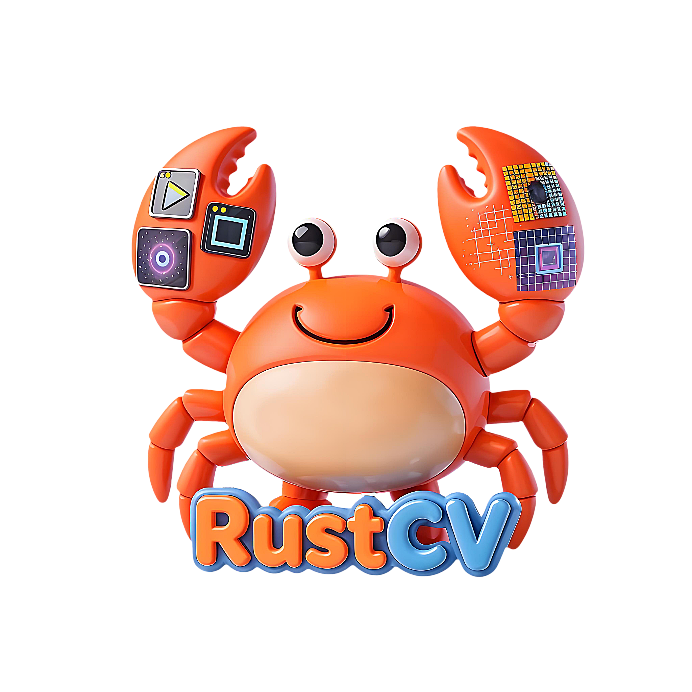
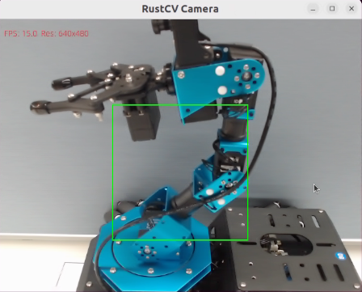
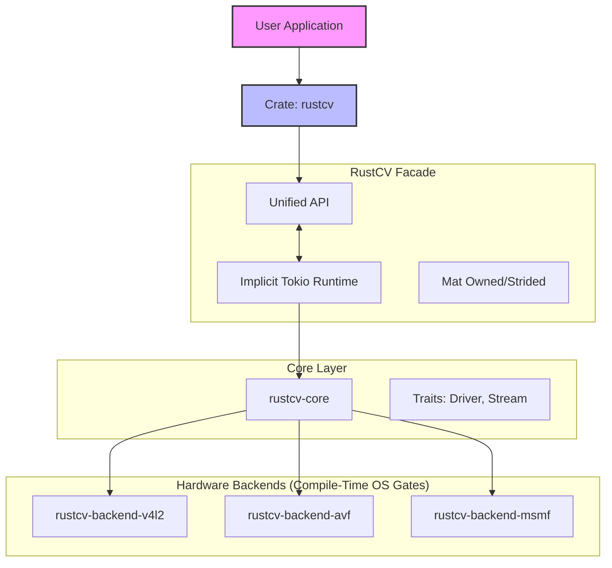

<div align="center">
 

# 📷 RustCV

[English](README.md) | 简体中文

### RustCV：用现代 Rust 重新定义的 OpenCV 兼容视觉处理框架

[](https://github.com/rustcv/rustcv)
[](#)
[](#)
[](#)
[](LICENSE)
[](https://www.rust-lang.org/)

🔗 [加入Discord社区](https://discord.gg/HkskXFgWAE)

**RustCV 是 OpenCV 在 Rust 时代的精神续作。**
它提供了一个统一的门面层（Facade），让你用最熟悉的 API 风格，享受 Rust 带来的内存安全与零拷贝高性能。

</div>

---

## 📖 简介 (Introduction)

**RustCV** 旨在解决 Rust 生态中机器视觉库碎片化的问题。它不是简单的 FFI 绑定，而是从零构建的纯 Rust 实现。

- **对标 OpenCV**：提供 `VideoCapture`, `Mat`, `imshow` 等经典 API，极大降低迁移成本。
- **隐藏复杂性**：底层基于 `Tokio` 异步驱动，但对外暴露**同步阻塞**接口。你不需要处理 `async/await`，就能享受异步 IO 的性能。
- **开箱即用**：智能识别当前操作系统，自动作为强制依赖链接最合适的原生底层驱动，真正做到“零配置跨平台”。

## ✨ 核心特性 (Key Features)

- 🦀 **Rust Native**: 纯 Rust 编写，无 C++ 依赖地狱。
- ⚡ **极致性能**:
  - 内部集成 `Lazy Global Runtime`，自动管理异步硬件交互。
  - 支持 `Stride` 内存布局，直接映射硬件视频缓冲区，并且实现了**高度优化的零开销边界转换（Zero-bounds-checking copy/SIMD ready）**。
- 🎨 **全平台原生驱动体系**:
  - **Linux**: 原生 `V4L2` 驱动集成。
  - **macOS**: 原生 `AVFoundation` 驱动集成（支持 32BGRA 高效直出与 GCD 调度）。
  - **Windows**: 原生 `MediaFoundation` (MSMF) 驱动集成。
- 🛠️ **动态热重载与强类型**: 拒绝魔法数字，提供 `cap.set_resolution(1280, 720)` 等强类型 API，支持在不丢失摄像头句柄的情况下热切换硬件分辨率。

## 🖥️ 平台支持 (Platform Support)

本项目现已完成三大主流桌面操作系统的核心底层驱动适配：

| 平台        | 后端技术        | 状态                            | 核心能力                                                               |
| :---------- | :-------------- | :------------------------------ | :--------------------------------------------------------------------- |
| **Linux**   | **V4L2**        | 🟢 稳定支持 | YUYV/MJPEG 解码，硬件设备遍历，动态分辨率配置。 |
| **macOS**   | **AVFoundation**| 🟢 稳定支持 | 并发 GCD 队列渲染，BGRA 硬件直通缓存，零拷贝数据流，动态 Preset 配置。|
| **Windows** | **MSMF**        | 🟢 稳定支持 | Media Foundation 原生集成与硬件访问封装。 |

## 📦 安装 (Installation)

在你的 `Cargo.toml` 中添加依赖：

```toml
[dependencies]
rustcv = "0.1"

# 可选：如果希望启用高速硬件级别的 JPEG 解码
# rustcv = { version= "0.1", features = ["turbojpeg"] }
```

> **注意：** 库会自动根据当前编译所在的 `target_os` 拉取对应的底层依赖（`rustcv-backend-v4l2`, `rustcv-backend-avf`, 等等），无需任何手动 feature 配置即可跨平台编译通过！

## 🚀 快速开始 (Quick Start)

这是最激动人心的部分。看看代码是多么简洁，以下是一个具备**动态分辨率热切换**与**帧率检测**的完整实战用例：

```rust
use anyhow::Result;
use rustcv::{
    highgui,    // 窗口与事件循环
    imgproc,    // 图像处理与绘图原语
    prelude::*, // 自动引入 VideoCapture, Mat 等核心组件
};
use std::time::Instant;

fn main() -> Result<()> {
    // 1. 打开默认摄像头 (索引 0)
    // 隐藏的异步 Runtime 会在后台随之启动
    println!("Opening camera...");
    let mut cap = VideoCapture::new(0)?;

    // 2. 配置初始分辨率 (同步阻塞调用，确保硬件完成重置)
    cap.set_resolution(640, 480)?;
    
    // 预分配用于承载图像帧的内存矩阵
    let mut frame = Mat::empty();
    let mut high_res_mode = false;

    // 帧率统计器
    let mut last_time = Instant::now();
    let mut frame_count = 0;
    let mut fps = 0.0;

    println!("Start capturing... Press SPACE to toggle resolution. Press ESC to exit.");

    // 3. 经典 OpenCV 风格的主循环读取
    while cap.read(&mut frame)? {
        if frame.is_empty() { continue; }

        // --- 图像处理 (零拷贝/In-place 修改) ---
        // 绘制一个静态追踪框
        imgproc::rectangle(
            &mut frame,
            imgproc::Rect::new(200, 150, 240, 240),
            imgproc::Scalar::new(0, 255, 0), // 绿色 (BGR)
            2,
        );

        // 每十帧更新一次计算出的 FPS
        frame_count += 1;
        if frame_count % 10 == 0 {
            fps = 10.0 / last_time.elapsed().as_secs_f64();
            last_time = Instant::now();
            frame_count = 0;
        }

        // 渲染 HUD 文字（红色）
        let hud_text = format!("FPS: {:.1}  Res: {}x{}", fps, frame.cols, frame.rows);
        imgproc::put_text(
            &mut frame,
            &hud_text,
            imgproc::Point::new(10, 30),
            1.0, 
            imgproc::Scalar::new(0, 0, 255), 
        );

        // --- 跨平台窗口显示 ---
        highgui::imshow("RustCV Camera Pipeline", &frame)?;

        // --- 键盘事件与动态控制 ---
        let key = highgui::wait_key(1)?;
        if key == 27 { // ESC 键退出
            break;
        }

        // 按下空格键：动态修改硬件采集分辨率（热重载底层硬件管道）
        if key == 32 {
            high_res_mode = !high_res_mode;
            let (w, h) = if high_res_mode { (1280, 720) } else { (640, 480) };
            println!("🔄 Hot Reloading hardware resolution to {}x{}...", w, h);
            
            if let Err(e) = cap.set_resolution(w, h) {
                eprintln!("❌ Failed to reload: {}", e);
            }
        }
    }

    // 4. 清理资源 (底层管线会自动妥善 Drop，手动调用更加规范)
    highgui::destroy_all_windows()?;
    Ok(())
}
```

运行示例：

```bash
cargo run --example camera_demo -p rustcv
```



## 🏗️ 架构 (Architecture)

RustCV 采用**门面模式 (Facade Pattern)** 设计，底层模块化，上层统一化。它会在编译期根据操作系统的宏来强制包含正确的实现后端，从而确保多平台下的绝对可靠性。


```mermaid
graph TD
    User[User Application] --> RustCV[Crate: rustcv]

    subgraph "RustCV Facade"
        API[Unified API]
        RT[Implicit Tokio Runtime]
        Mat[Mat Owned/Strided]
    end

    RustCV --> API
    API <--> RT

    subgraph "Core Layer"
        Core[rustcv-core]
        Traits[Traits: Driver, Stream]
    end

    RT --> Core

    subgraph "Hardware Backends (Compile-Time OS Gates)"
        V4L2[rustcv-backend-v4l2]
        AVF[rustcv-backend-avf]
        MSMF[rustcv-backend-msmf]
    end

    Core --> V4L2
    Core --> AVF
    Core --> MSMF

    style User fill:#f9f,stroke:#333,stroke-width:2px
    style RustCV fill:#bbf,stroke:#333,stroke-width:2px
```

## 🤝 贡献 (Contributing)

我们欢迎任何形式的贡献！无论是提交 Issue、补全代码测试，还是移植全新的视觉算法，都非常欢迎！

1.  Fork 本仓库
2.  创建你的 Feature 分支 (`git checkout -b feature/AmazingFeature`)
3.  提交更改 (`git commit -m 'Add some AmazingFeature'`)
4.  推送到分支 (`git push origin feature/AmazingFeature`)
5.  提交 Pull Request

## 📄 许可证 (License)

Distributed under the MIT License. See `LICENSE` for more information.

---

<div align="center">
    Build with ❤️ in Rust
</div>
